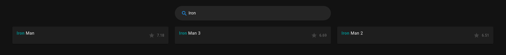
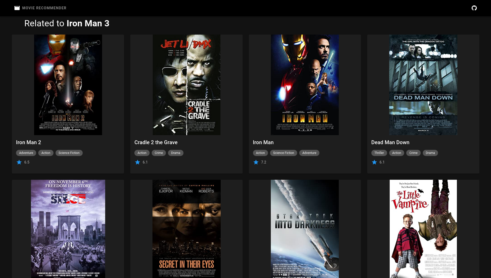

# Movie Recommender

_Movie recommender adaptation for [Kaggle notebook](#credits)._

# Download and install

This project uses two datasets that you can find in Kaggle. However, you only need to download the [TMDB 5000 Movie Dataset](https://www.kaggle.com/tmdb/tmdb-movie-metadata) and copy the files to the dataset directory. We use only one file from [The Movie Dataset](https://www.kaggle.com/rounakbanik/the-movies-dataset), but we had to modified it due to some minor issues, so that one is already included.

Clone or download this repository. You can find simplified instructions for installation in `server/` and `client/` directories, make sure to follow them in that order, first the server, then the client. If you need a more detailed explanation you can check our [Quick start guide](https://github.com/gammanc/movierecommender/wiki/Quick-start).

# How to use it 

On the main page you'll find the most popular movies. If you'd like to search for a specific film, you can start writing the title and you'll get suggestions as you're typing. For instance, when typing Iron Man, the following happens:

If you see a movie that you like, you can click on it and you'll get suggestions based on that movie. For instance, when looking for a movie similar to Iron Man 3, the following recommendations are given:

   

# Bugs and Feature Requests

Have a bug or a feature request? First, for existing and closed issues. If your problem or idea is not addressed yet, [please open a new issue](https://github.com/gammanc/movierecommender/issues). Please try to provide as much detail as posible.

# Contributing

Your contributions are always welcome! Please have a look at the [contribution guidelines](./CONTRIBUTING.md) first. :tada:

# Credits

A heartfelt thanks to Ibtesam Ahmed, author of the ["_Getting started with a Movie Recommendation System_"](https://www.kaggle.com/ibtesama/getting-started-with-a-movie-recommendation-system) Kaggle notebook. Her amazing work inspired us to try and build a clear and attractive user interface that can make use of her Movie Recommendation System.

This project uses the following open source languages and packages/libraries:

- [Python](https://www.python.org/)
- [Flask](https://flask.palletsprojects.com/)
- [Node.js](https://nodejs.org/es/)
- [Vue.js](https://vuejs.org/)

Content from [**OMDb Api**](http://www.omdbapi.com/) by Brian Fritz

# License

Released under the [GPLv3](./LICENSE) license
